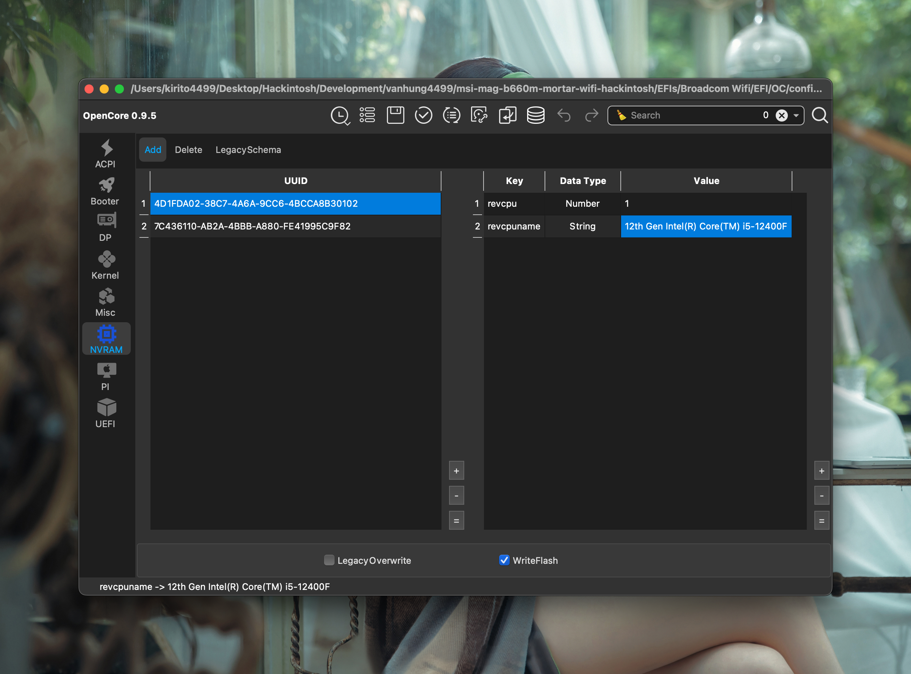
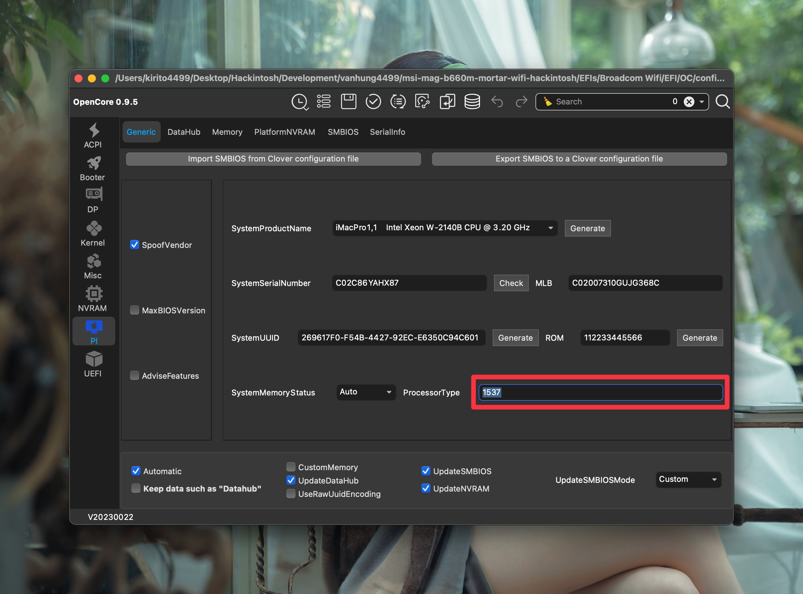
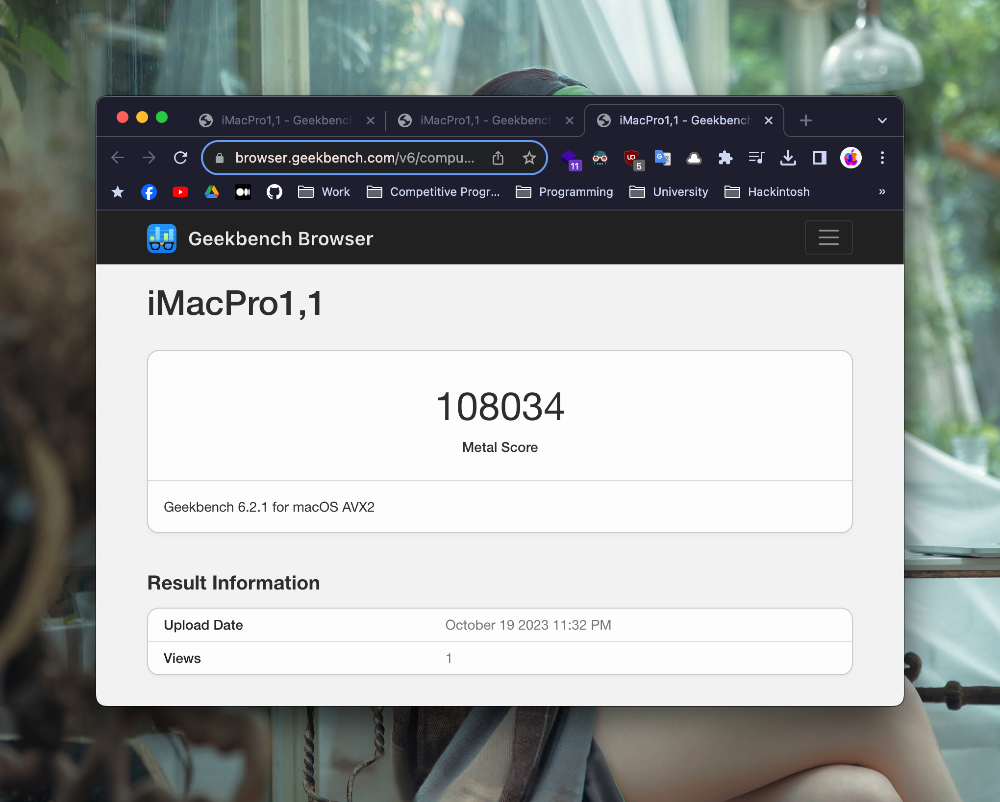

# [MSI-MAG-B660M-MORTAR-WIFI-DDR4](https://www.msi.com/Motherboard/MAG-B660M-MORTAR-WIFI-DDR4) Hackintosh

## Information

### Compatibility

You can use my efi to install macOS for MSI MAG B660M Mortar Wifi/Non-Wifi D4/D5!

### macOS versions tested

- macOS Sonoma 14.0
- macOS Ventura 13.6

### Bootloader

- [OpenCore](https://github.com/acidanthera/OpenCorePkg)
- Version: 0.9.5

### Repository

[Github](https://github.com/hackintosh-efi/MAG-B660M-MORTAR-WIFI-DDR4-OpenCore)

### My Hardwares

| Type        | Name                                 |
| ----------- | ------------------------------------ |
| Motherboard | MSI MAG B660M MORTAR WIFI DDR4       |
| CPU         | Intel i5-12400F                      |
| RAM         | GSkill Tridentz 2x16GB DDR4 3600MHz  |
| SSD         | WD BLACK SN750 1TB                   |
| GPU         | GIGABYTE Radeon RX 6600 EAGLE        |
| Audio       | Realtek ALC897                       |
| Ethernet    | Realtek RTL8125 2.5 Gigabit Ethernet |
| Wifi        | Intel Wi-Fi 6E AX211 (Built-in)      |
| Wifi        | Broadcom BCM94360CS2                 |
| Monitor     | DELL P2715Q (4K) + DELL P2419H (FHD) |
| PSU         | COOLERMASTER GX650W 80Plus Gold      |

## Installation

### EFIs

I maked 2 EFIs depend on wifi card

- Intel Wifi: `EFIs/Intel Wifi/EFI`
  - Only wifi works well, Bluetooth is not stable!
- Broadcom Wifi: `EFIs/Broadcom Wifi/EFI`
  - Fully working include wifi/bluetooth/airdrop/handoff!
  - If you install Sonoma 14.x, after install, you need run [OCLP](https://github.com/dortania/OpenCore-Legacy-Patcher) root patch

### Bios Setup

- **Save & Exit**
  - Restore Defaults → **Yes**

- **Settings**
  - **Advanced**
    - PCI sub-system Settings
      - Above 4G memory/Crypto Currentcy mining → **Enabled**
    - Integrated Peripherals
      - SATA Configuration
        - SATA Mode → **AHCI Mode**
    - Intergrated Graphics Configuration
      - Integrated Grahics Adapter → **PEG** 
      - IGD Multi-Monitor → **Disabled** (If available)
    - USB Configuration
      - XHCI Hand-off → **Enabled**
    - Windows OS Configuration
      - MSI Fast boot → **Disabled**
      - Fast Boot → **Disabled**

- **OC (Overclocking)**
  - Extreme Memory Profile(X.M.P) → **Enabled**
  - CPU Features
    - Intel VT-D Tech → **Disabled**
    - CFG Lock → **Disabled**

### Notes

#### USB Ports

If you have some usb ports don't work, let's remap usb with [USBToolBox](https://github.com/USBToolBox/tool)

#### GPU

- If you use a Polaris GPU like RX 560/570/580, remove `agdpmod=pikera` in `boot-args`
- If you use a Navi GPU like RX 6600XT/6800XT/6900XT, don't need to do anything!

#### CPU:

If you use another 12th/13th CPU, change your CPU name:

If your CPU have more than 8 core (like i5-12600K or above), change **ProcesserType = 3841**

[OC Auxiliary Tools](https://github.com/ic005k/OCAuxiliaryTools) can help you edit config.plist!

## Results

### What works and What doesn't or WIP:

Everything work properly!

- [x] Intel Core i5-12400F
- [x] Gigabyte RX 6600 Eagle 8GB
- [x] ALC897 Internal Speakers
- [x] ALC897 HDMI Audio Output
- [x] All USB Ports 
- [x] Wi-Fi and Bluetooth (Intel/Broadcom)
- [x] Airdrop/Handoff
- [x] RTL8125 Ethernet
- [x] Sleep/Wake
- [x] NVRAM

### ScreenShots

- Sonoma

### Geekbench Scores
- Geekbench 6 CPU i5-12400F Score

- Geekbench 6 Metal Score

- Geekbench 6 OpenCL Score

## Credits

- [Acidanthera](https://github.com/acidanthera) for OpenCore and all the lovely hackintosh work.
- [Apple](https://apple.com) for macOS.
- [Dortania](https://github.com/dortania)
- [VNOHackintosh](https://www.facebook.com/groups/vnohackintosh)
- [Hackintool](https://github.com/headkaze/Hackintool)

## Contact Me

- FB: https://www.facebook.com/vanhung4499/
- FB Group: https://www.facebook.com/groups/vnohackintosh